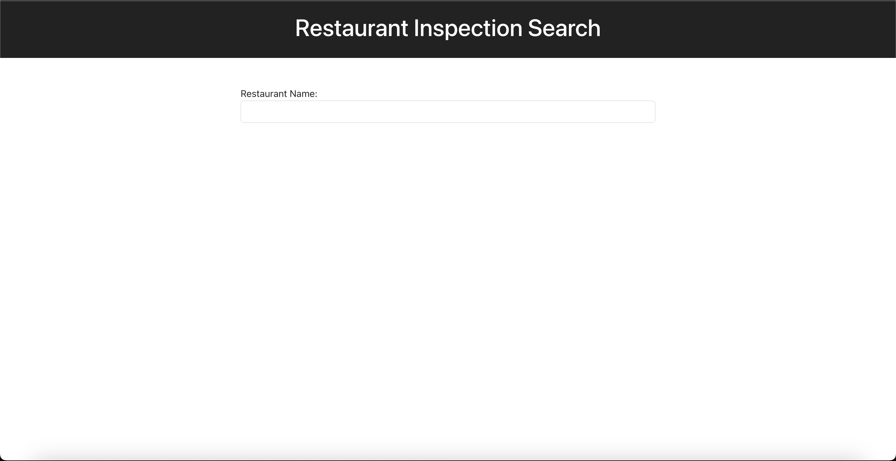
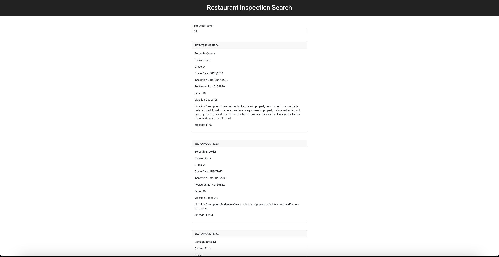
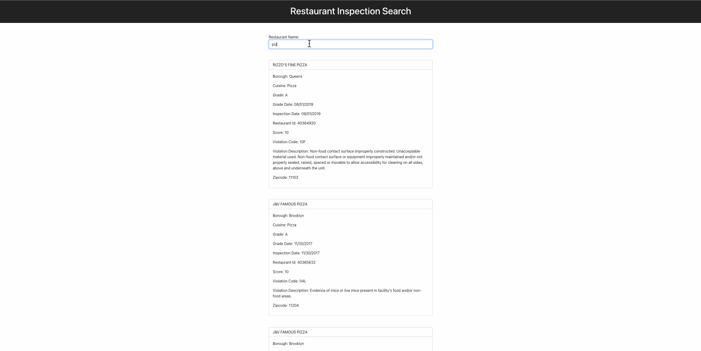

**Due date: Tuesday, November 5 @ 11:59PM EST.**

**Submit via BlackBoard**

# Restaurant Inspection Client Part One

For this assignment, you are provided with code (generated mainly by [vite](https://vitejs.dev/guide/)) to create a small application that allows users to search for restaurant inspections. Please check out the attached images and gifs below to see the output of a working solution.

For this assignment, you will use the [Restaurant Inspection API](https://restaurant-inspection-api-40554916dc60.herokuapp.com/) to search for inspections.

To search for restaurant inspections, you will want to send a request to the following URL:
```
https://restaurant-inspection-api-40554916dc60.herokuapp.com/search?restaurant_name=restaurantNameGoesHere
```

Please note that you will have to replace `restaurantNameGoesHere` with the restaurant name that the user provides.

## Requirements

- When a user types a restaurant name, the application will retrieve restaurant inspections from the specified API.
- When the user types a restaurant name that has no inspections, the application should display:` No results found.`
- A complete solution will reduce unnecessary API calls.

## Mockups

Add an input field where the user can enter a restaurant name, like in the following image:



Use the user input to search against the Restaurant Inspections API. The API will respond with an object for each restaurant inspection if any matches exist. Use that response to display each inspection in a separate div, like in the following image:



Below you will find a small demo of a working solution.


> NOTE: Your styles (colors and look) don't have to be exact. I will only grade you for the functionality.

## Getting Started
Install Application Dependencies
```
npm install
```

Run Application
```
npm run dev
```

Visit Application
```
open http://localhost:5173/
```

Example API Request
```
curl --location --request GET 'https://restaurant-inspection-api-40554916dc60.herokuapp.com/search?restaurant_name=pizza'
```

Example API Response:
```
{
   "data" : [
      {
         "borough" : "Queens",
         "cuisine" : "Pizza",
         "grade" : "A",
         "grade_date" : "08/01/2019",
         "inspection_date" : "08/01/2019",
         "restaurant_id" : "40364920",
         "restaurant_name" : "RIZZO'S FINE PIZZA",
         "score" : "10",
         "violation_code" : "10F",
         "violation_description" : "Non-food contact surface improperly constructed. Unacceptable material used. Non-food contact surface or equipment improperly maintained and/or not properly sealed, raised, spaced or movable to allow accessibility for cleaning on all sides, above and underneath the unit.",
         "zipcode" : "11103"
      },
      ...
   ]
}
```

## Submission

**Please make sure only to submit the App.jsx and App.css files via Blackboard.**

The assignment's grading is as follows:
  - 50% for retrieving data from the API.
  - 30% for surfacing data from the API.
  - 10% for handling errors and no results from the API.
  - 10% for reducing the amount of API calls made.
